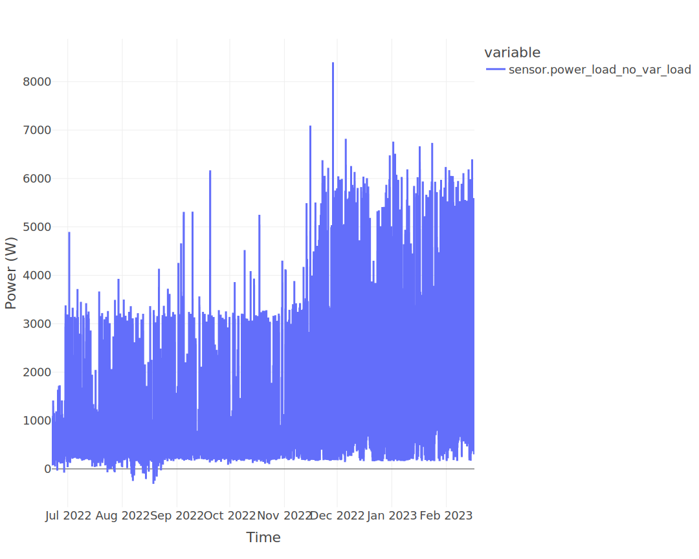
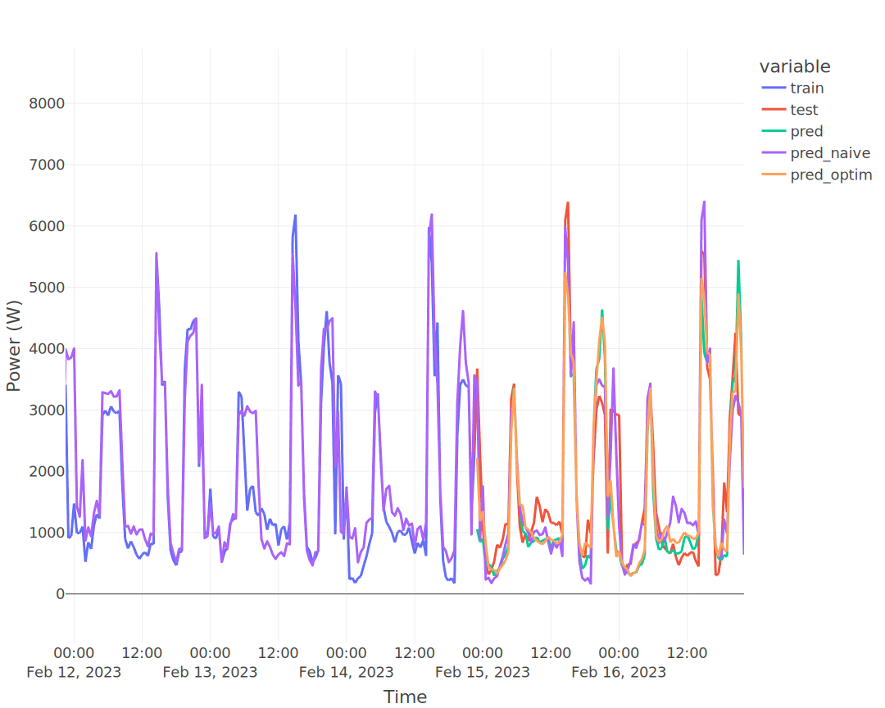

# The machine learning forecaster

Starting with v0.4.0, a new forecast framework is proposed within EMHASS. It provides a more efficient way to forecast the power load consumption. It is based on the `skforecast` module that uses `scikit-learn` regression models considering auto-regression lags as features. The hyperparameter optimization is proposed using bayesian optimization from the `optuna` module.

This API provides three main methods:

- fit: to train a model with the passed data. This method is exposed with the `forecast-model-fit` end point.

- predict: to obtain a forecast from a pre-trained model. This method is exposed with the `forecast-model-predict` end point.

- tune: to optimize the models hyperparameters using bayesian optimization. This method is exposed with the `forecast-model-tune` end point.

## A basic model fit

To train a model use the `forecast-model-fit` end point. 

Some paramters can be optionally defined at runtime:

- `days_to_retrieve`: the total days to retrieve from Home Assistant for model training. Defined this in order to retrieve as much history data as possible.

- `model_type`: define the type of model forecast that this will be used for. For example: `load_forecast`. This should be an unique name is you are using multiple custom forecast models.

- `var_model`: the name of the sensor to retrieve data from Home Assistant. Example: `sensor.power_load_no_var_loads`.

- `sklearn_model`: the `scikit-learn` model that will be used. For now only this options are possible: `LinearRegression`, `ElasticNet` and `KNeighborsRegressor`.

- `num_lags`: the number of auto-regression lags to consider. A good starting point is to fix this as one day. For example if your time step is 30 minutes, then fix this to 48, if the time step is 1 hour the fix this to 24 and so on.

- `split_date_delta`: the delta from now to `split_date_delta` that will be used as the test period to evaluate the model.

- `perform_backtest`: if `True` then a back testing routine is performed to evaluate the performance of the model on the complete train set.

The default values for these parameters are:
```
runtimeparams = {
    "days_to_retrieve": 30,
    "model_type": "load_forecast",
    "var_model": "sensor.power_load_no_var_loads",
    "sklearn_model": "KNeighborsRegressor",
    "num_lags": 48,
    "split_date_delta": '48h',
    "perform_backtest": False
}
```

A correct `curl` call to launch a model fit can look like this:
```
curl -i -H "Content-Type:application/json" -X POST -d '{}' http://localhost:5000/action/forecast-model-fit
```

As an example, the following figure shows a 240 days load power data retrieved from EMHASS and that will be used for a model fit:



After applying the `curl` command to fit the model the following information is logged by EMHASS:

    2023-02-20 22:05:22,658 - __main__ - INFO - Training a KNN regressor
    2023-02-20 22:05:23,882 - __main__ - INFO - Elapsed time: 1.2236599922180176
    2023-02-20 22:05:24,612 - __main__ - INFO - Prediction R2 score: 0.2654560762747957

As we can see the $R^2$ score for the fitted model on the 2 day test perdiod is $0.27$.
A quick prediction graph using the fitted model should be available in the webui:


Visually the prediction looks quite acceptable but we need to evaluate this further. For this we can use the `"perform_backtest": True` option to perform a backtest evaluation using this syntax:
```
curl -i -H "Content-Type:application/json" -X POST -d '{"perform_backtest": True}' http://localhost:5000/action/forecast-model-fit
```

The results of the backtest will be shown in the logs:

    2023-02-20 22:05:36,825 - __main__ - INFO - Simple backtesting
    2023-02-20 22:06:32,162 - __main__ - INFO - Backtest R2 score: 0.5851552394233677

So the mean backtest metric of our model is $R^2=0.59$. 

Here is the graphic result of the backtesting routine:


## The predict method

To obtain a prediction using a previously trained model use the `forecast-model-predict` end point. 
```
curl -i -H "Content-Type:application/json" -X POST -d '{}' http://localhost:5000/action/forecast-model-predict
```
If needed pass the correct `model_type` like this:
```
curl -i -H "Content-Type:application/json" -X POST -d '{"model_type": "load_forecast"}' http://localhost:5000/action/forecast-model-predict
```
The resulting forecast DataFrame is shown in the webui.

It is possible to publish the predict method results to a Home Assistant sensor. By default this is desactivated but it can be activated by using runtime parameters.

The list of parameters needed to set the data publish task is:

- `model_predict_publish`: set to `True` to activate the publish action when calling the `forecast-model-predict` end point.

- `model_predict_entity_id`: the unique `entity_id` to be used.

- `model_predict_unit_of_measurement`: the `unit_of_measurement` to be used.

- `model_predict_friendly_name`: the `friendly_name` to be used.

The default values for these parameters are:
```
runtimeparams = {
    "model_predict_publish": False,
    "model_predict_entity_id": "sensor.p_load_forecast_custom_model",
    "model_predict_unit_of_measurement": "W",
    "model_predict_friendly_name": "Load Power Forecast custom ML model"
}
```

## The tuning method with Bayesian hyperparameter optimization

With a previously fitted model you can use the `forecast-model-tune` end point to tune its hyperparameters. This will be using bayeasian optimization with a wrapper of `optuna` in the `skforecast` module.

The syntax will be:
```
curl -i -H "Content-Type:application/json" -X POST -d '{}' http://localhost:5000/action/forecast-model-tune
```
This will launch the optimization routine and optimize the internal hyperparamters of the `scikit-learn` regressor and it will find the optimal number of lags.
The following are the logs with the results obtained after the optimization for a KNN regressor:

    2023-02-20 22:06:43,112 - __main__ - INFO - Backtesting and bayesian hyperparameter optimization
    2023-02-20 22:25:29,987 - __main__ - INFO - Elapsed time: 1126.868682384491
    2023-02-20 22:25:50,264 - __main__ - INFO - ### Train/Test R2 score comparison ###
    2023-02-20 22:25:50,282 - __main__ - INFO - R2 score for naive prediction in train period (backtest): 0.22525145245617462
    2023-02-20 22:25:50,284 - __main__ - INFO - R2 score for optimized prediction in train period: 0.7485208725102304
    2023-02-20 22:25:50,312 - __main__ - INFO - R2 score for non-optimized prediction in test period: 0.7098996657492629
    2023-02-20 22:25:50,337 - __main__ - INFO - R2 score for naive persistance forecast in test period: 0.8714987509894714
    2023-02-20 22:25:50,352 - __main__ - INFO - R2 score for optimized prediction in test period: 0.7572325833767719

This is a graph comparing these results:



The naive persistance load forecast model performs very well on the 2 day test period with a $R^2=0.87$, however is well out-performed by the KNN regressor when back-testing on the complete training set (10 months of 30 minute time step data) with a score $R^2=0.23$.

The hyperparameter tuning using bayesian optimization improves the bare KNN regressor from $R^2=0.59$ to $R^2=0.75$. The optimized number of lags is $48$.

```{warning} 

The tuning routine can be computing intense. If you have problems with computation times, try to reduce the `days_to_retrieve` parameter. In the example shown, for a 240 days train period, the optimization routine took almost 20 min to finish on an amd64 Linux architecture machine with a i5 processor and 8 Gb of RAM. This is a task that should be performed once in a while, for example every week.
```

## How does this works? 
This machine learning forecast class is based on the `skforecast` module. 
We use the recursive autoregresive forecaster with added features. 

I will borrow this image from the `skforecast` [documentation](
https://joaquinamatrodrigo.github.io/skforecast/0.6.0/user_guides/autoregresive-forecaster.html) that help us understand the working principles of this type of model. 

 

With this type of model what we do in EMHASS is to create new features based on the timestamps of the data retrieved from Home Assistant. We create new features based on the day, the hour of the day, the day of the week, the month of the year, among others. 

What is interesting is that these added features are based on the timestamps, they always known in advance and useful for generating forecasts. These are the so-called future known covariates.

In the future we may test to expand using other possible known future covariates from Home Assistant, for example a known (forecasted) temperature, a scheduled presence sensor, etc.

## Going further?
This class can be gebneralized to actually forecasting any given sensor variable present in Home Assistant. It has been tested and the main initial motivation for this development was for a better load power consumption forecasting. But in reality is has been coded in a flexible way so that you can control what variable is used, how many lags, the amount of data used to train the model, etc.

So you can really go further and try to forecast other types of variables and possible use the results for some interesting automations in Home Assistant. If doing this, was is important is to evaluate the pertinence of the obtained forecasts. The hope is that the tools proposed here can be used for that purpose.