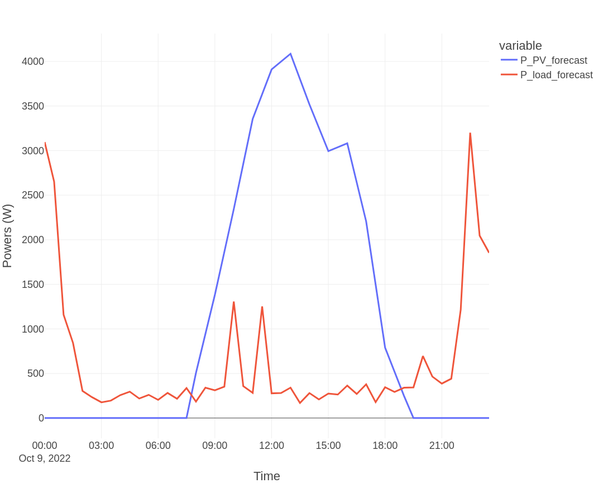
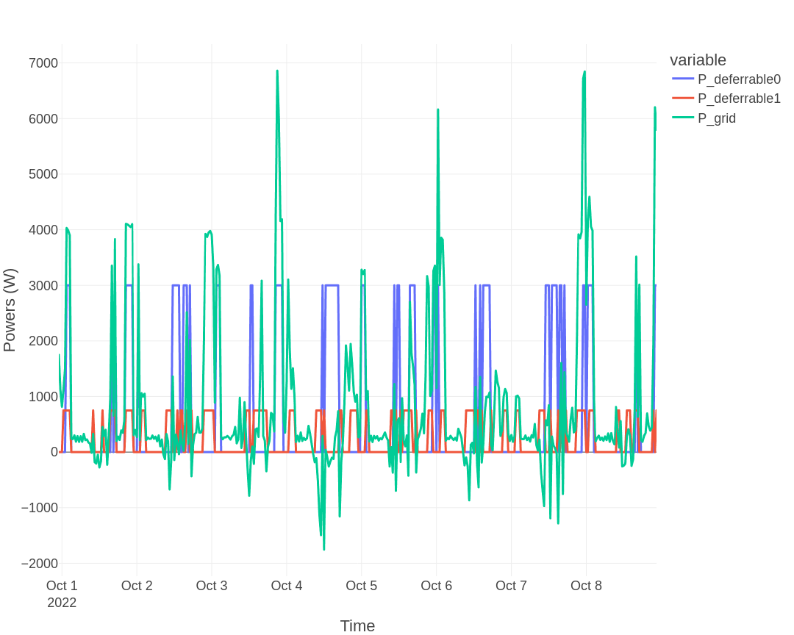
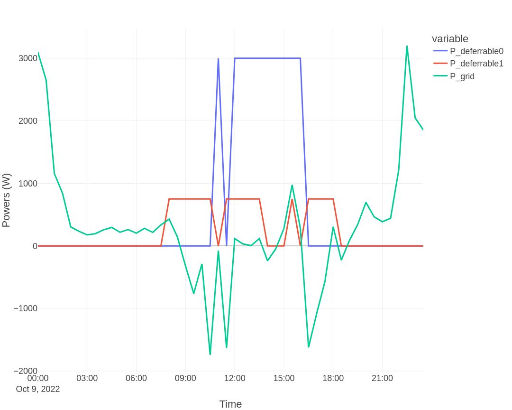

# A real study case

In this section a study case using real data is presented.


## First test system: a simple system with no PV and two deferrable loads

In this example we will consider an even more simple system with no PV installation and just two deferrable loads that we want to optimize their schedule.

For this the following parameters can be added to the `secrets.yaml` file: `solar_forecast_kwp: 0`. And also we will set the PV forecast method to `method='solar.forecast'`. This is a simple way to just set a vector with zero values on the PV forecast power, emulating the case where there is no PV installation. The other values on the configuration file are set to their default values.

### Day-ahead optimization

Let's performa a day-ahead optimization task on this simple system. We want to schedule our two deferrable loads.

For this we use the following command (example using the legacy EMHASS Python module command line):
```
emhass --action 'dayahead-optim' --config '/home/user/emhass/config_emhass.yaml' --costfun 'profit'
```

The retrieved input forecasted powers are shown below:



Finally, the optimization results are:


For this system the total value of the obtained cost function is -5.38 EUR. 

## A second test system: a 5kW PV installation and two deferrable loads

Let's add a 5 kWp solar production with two deferrable loads. No battery is considered for now. The configuration used is the default configuration proposed with EMHASS. 

We will first consider a perfect optimization task, to obtain the optimization results with perfectly know PV production and load power values for the last week.

### Perfect optimization

Let's perform a 7-day historical data optimization.

For this we use the following command (example using the legacy EMHASS Python module command line):
```
emhass --action 'perfect-optim' --config '/home/user/emhass/config_emhass.yaml' --costfun 'profit'
```

The retrieved input powers are shown below:


The input load cost and PV production selling prices are presented in the following figure:


Finally, the optimization results are:



For this 7-day period, the total value of the cost function was -26.23 EUR. 

### Day-ahead optimization

As with the simple system we will now perform a day-ahead optimization task. We use again the `dayahead-optim` action or end point.

The optimization results are:



For this system the total value of the obtained cost function is -1.56 EUR. We can note the important improvement on the cost function value whenn adding a PV installation.

## A third test system: a 5kW PV installation, a 5kWh battery and two deferrable loads

Now we will consider a complet system with PV and added batteries. In this case we want to schedule our deferrable loads but also the battery charge/discharge. We use again the `dayahead-optim` action or end point.

The optimization results are:


The battery state of charge plot is shown below:


For this system the total value of the obtained cost function is -1.23 EUR, a substantial improvement when adding a battery.

## Some real forecast data

The real implementation of EMHASS and its efficiency depends on the quality of the forecasted PV power production and the house load consumption.

Here is an extract of the PV power production forecast with the default PV forecast method from EMHASS: a web scarpping of the clearoutside page based on the defined lat/lon location of the system. These are the forecast results of the GFS model compared with the real PV produced data for a 4 day period. 


